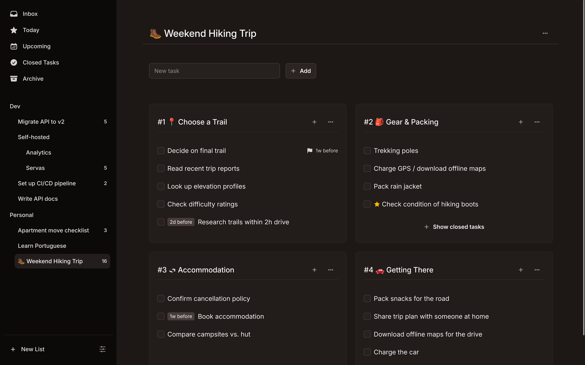

# Conao

A free, self-hosted task manager. Simple, fast, and works on any device.

**[Website](https://conao.app/) · [Releases](https://conao.app/releases)**

[](https://conao.app/)

> More screenshots available on the [website](https://conao.app/#see-it-in-action).

## Features

- **Inbox** — Quickly capture tasks and sort them later
- **Upcoming View** — See what's coming up across all your lists
- **Task Lists & Groups** — Organize tasks into lists and group them however you like
- **Archive** — Done tasks stay out of sight but never lost
- **Deadlines & Planned Dates** — Set due dates and plan when to work on tasks
- **Notes** — Add details and context to any task
- **Dark & Light Theme** — Choose the look that suits you

## Installation

Conao is distributed as a Docker image.

### 1. Create a `compose.yaml`

```yaml
services:
    conao:
        image: beromir/conao:latest
        container_name: conao
        restart: unless-stopped
        ports:
            - '8093:80'
        environment:
            - APP_URL=http://conao.localhost
            - APP_KEY="GENERATED_KEY"
        volumes:
            - ./sqlite:/app/database/sqlite
```

Set `APP_URL` to the URL where you will access Conao.

### 2. Start the container

```bash
docker compose up -d
```

### 3. Generate an application key

```bash
docker exec -it conao php artisan key:generate --show
```

### 4. Set the application key

Copy the generated key and set it as the `APP_KEY` environment variable in your `compose.yaml`.

### 5. Recreate the container

```bash
docker compose up -d --force-recreate
```

## License

[MIT](LICENSE)
